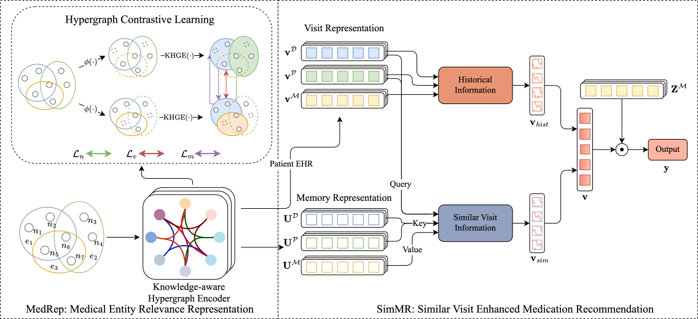

# HypeMed: Enhancing Medication Recommendations with Hypergraph-Based Patient Relationships
This paper proposes a medication recommendation method that utilizes the hypergraph approach to capture cross-patient relationships in Electronic Health Records.


<!-- *The Architecture of HypeMed. The proposed HypeMed model consists of two main modules: the Medical Entity Hypergraph Contrastive Learning Module (MHCL) and the Relationship Enhanced Medication Prediction Module (REMP). MHCL is responsible for learning contextual representations of medical entities using hypergraph contrastive learning. REMP combines representations from multiple channels and utilizes a vector dot predictor to make medication recommendations.* -->

*Overall architecture of HypeMed. HypeMed comprises two stages: the Medical Entity Relevance Representation Stage (MedRep) and the Similar Visit Enhanced Medication Recommendation Stage (SimMR). MedRep focuses on encoding intra-visit set-level combinatorial semantics into a globally consistent, retrieval-friendly embedding space. SimMR integrates longitudinal history and visit-conditioned retrieved similar visits to refine latent condition estimation.*

# Abstract
AI-driven medication recommendation aims to generate safe and effective medication combinations from patients’ electronic health records (EHRs). However, accurately recommending medications hinges on inferring a patient’s latent clinical condition from sparse and noisy observations, which requires both (i) preserving the visit-level combinatorial semantics of co-occurring diagnoses/procedures and (ii) leveraging informative historical references through effective, visit-conditioned retrieval. Most existing methods fall short in one of these aspects: graph-based modeling often fragments higher-order intra-visit patterns into pairwise relations, while inter-visit augmentation methods commonly exhibit an imbalance between learning a globally stable representation space and performing dynamic retrieval within it. To address these limitations, this paper proposes HypeMed, a two-stage hypergraph-based medication recommendation framework that unifies intra-visit coherence modeling with inter-visit reference augmentation. In the first stage, MedRep represents each visit as a hyperedge and performs knowledge-aware hypergraph contrastive pre-training to encode high-order interactions into a globally consistent, retrieval-friendly embedding space. In the second stage, SimMR conducts visit-conditioned dynamic retrieval directly in this hyperedge-aware space and fuses the retrieved references with the patient’s longitudinal history to refine condition estimation and improve medication prediction. Experiments on MIMIC-III/IV and eICU demonstrate that HypeMed consistently improves recommendation accuracy while reducing the drug–drug interaction (DDI) rate, indicating enhanced effectiveness and safety. The implementation is publicly available at https://github.com/xansar/HypeMed.

## Table of Contents
- [Description](#description)
- [Requirements](#requirements)
- [Usage](#usage)

## Description
This project contains the necessary python scripts for HypeMed as well as the directions. 
Considering that unauthorized public access to the MIMIC-III and MIMIC-IV databases is prohibited to distribute, we only provide the example data (first 100 entries of records of MIMIC-III and MIMIC-IV) in `data`. You can use our provided scripts to preprocess the raw data once you have obtained the relevant data.

## Requirements
```text
Python==3.8.36
Torch==1.13.1+cu116
NumPy==1.24.4
```

## Usage

Below is a guide on how to use the scripts. Before processing, please change the `'pathtomimic'` in `HypeMed.py` to the real path.

Please download **drug-DDI.csv**, which a large file, containing the drug DDI information. Please put it in `data`. The file could be downloaded from https://drive.google.com/file/d/1mnPc0O0ztz0fkv3HF-dpmBb8PLWsEoDz/view?usp=sharing

```bash
# Data Processing.
python data/processing.py # MIMIC-III
python data/processing_4.py #MIMIC-IV

# Contrastive Learning Pretraing (on MIMIC-III)
python HypeMed.py --pretrain --pretrain_epoch 3 --pretrain_lr 1e-3 --pretrian_weight_decay 1e-5 --mimic 3 --name example
# debug 
python HypeMed.py --debug --mimic 3 --pretrain_epoch 3 --name example
# Training
python HypeMed.py --mimic 3 --pretrain_epoch 3 --name example
# Testing
python HypeMed.py --mimic 3 --pretrain_epoch 3 --Test --name example
# ablation study
python HypeMed.py --mimic 3 --pretrain_epoch 3 --channel_ablation only_his --name example
```
You can explore all adjustable hyperparameters through the `config.py` file.

## Acknowledgement

This project was inspired by and partially built upon several excellent open-source repositories. We sincerely thank the original authors for making their code publicly available.

Special thanks to:
- [SafeDrug](https://github.com/ycq091044/SafeDrug)
- [COGNet](https://github.com/BarryRun/COGNet)
- [GAMENet](https://github.com/sjy1203/GAMENet)
- [mimic-code](https://github.com/MIT-LCP/mimic-code)

Their valuable implementations greatly helped the development of this project.
